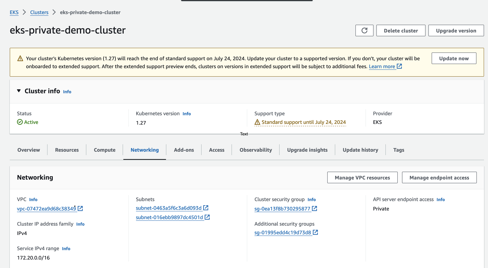

# Steps to create EKS Private Cluster with eksctl
## Steps:
Using eksctl we will create a fully-private clusters that have no outbound internet access and have only private subnets. VPC endpoints are used to enable private access to AWS services.

This guide describes how to create a private cluster without outbound internet access.

### Create the cluster:
```bash linenums="1"
eksctl create cluster --config-file=eks-cluster-config.yaml --without-nodegroup
```

### Verify cluster creation:

Use the following command to check the cluster status:

```bash linenums="1"
 eksctl get cluster eks-private-demo-cluster
```

In the AWS console, you can check the cluster is created with the right VPC, Subnets and most importanly with EKS Private Endpoint.



